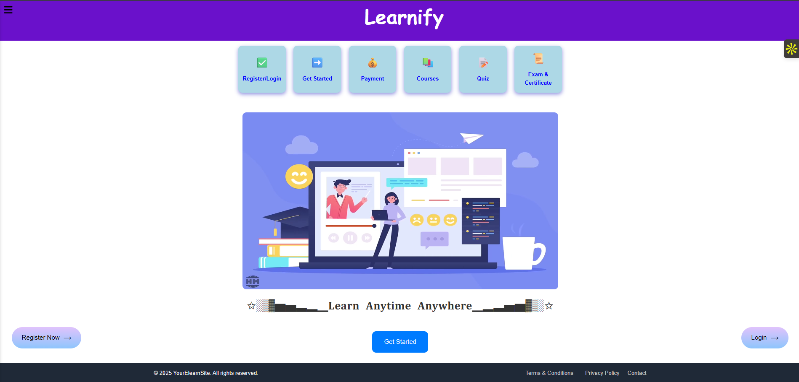
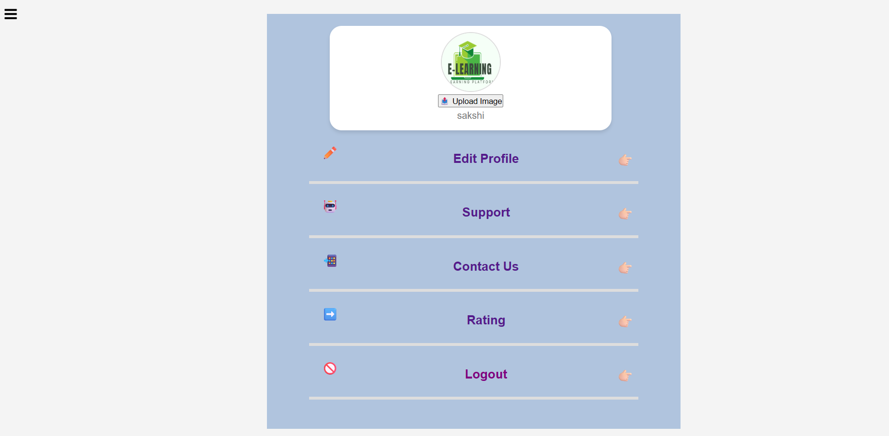

# 📚 E-Learning Platform

> 🎓 **A complete, interactive e-learning platform** designed to help students learn programming through structured video courses, quizzes, and certification.

---

## ✨ Live Demo

> 🔗 https://sakshimalkar.github.io/E-Learning/

---

## 📸 Project Preview

| Homepage | Quiz Section | About Us |
|----------|--------------|----------|
|  |  |  |  |  |  |

> *Note: Replace placeholder images with actual screenshots of your project*

---

## 🚀 Features

### 👨‍💻 For Students
| Feature | Description |
|---------|-------------|
| 📹 **Video Lectures** | Structured courses with high-quality video tutorials |
| 📝 **Interactive Quizzes** | Timed quizzes with instant scoring and feedback |
| 📄 **PDF Resources** | Downloadable study materials for offline learning |
| 🎓 **Certification** | Generate certificates upon course completion |
| 👤 **User Profile** | Track progress and manage account settings |

### 🎨 Technical Highlights
| Feature | Description |
|---------|-------------|
| ✅ **Responsive Design** | Fully responsive — works on mobile, tablet, and desktop |
| ✅ **Sidebar Navigation** | Clean, intuitive sidebar menu for easy access |
| ✅ **Timer-Based Quiz** | 5-minute timer with auto-submit functionality |
| ✅ **LocalStorage** | Saves quiz scores and user progress locally |
| ✅ **Interactive UI** | Smooth animations and hover effects |

---

## 🛠️ Technologies Used

| Category | Technologies |
|----------|--------------|
| **Frontend** | HTML5, CSS3, JavaScript, Tailwind CSS |
| **Backend** | PHP (for forms & data handling) |
| **Database** | MySQL (for user data and course management) |
| **Version Control** | Git & GitHub |
| **Icons** | Font Awesome |
| **Fonts** | Google Fonts (Poppins) |

---

## 📂 Project Structure

 
 # 📚 Learnify — E-Learning Platform

> *Transform your career through quality education — anytime, anywhere.*

---

## 🎯 Featured Sections

### 📖 **Learn Anytime, Anywhere**
- Access high-quality video courses from industry experts
- Learn at your own pace with lifetime access to content

### ✅ **Interactive Quizzes & Assessments**
- Timed quizzes with instant scoring and feedback
- Track your progress and earn certificates upon completion

### 📄 **Study Resources & PDFs**
- Downloadable study materials for offline learning
- Comprehensive notes and practice questions

---

## ✨ Features

| Feature | Description |
|---------|-------------|
| 🎥 **High-Quality Video Lectures** | Structured courses with clear, professional video tutorials |
| 🧠 **Smart Quiz System** | 5-minute timer, auto-submit, and instant results |
| 📑 **PDF Resource Library** | Downloadable notes and study materials per course |
| 🎓 **Certificate Generation** | Earn certificates after passing course quizzes |
| 👤 **User Profile Dashboard** | Track your learning progress and manage account |
| 💳 **Secure Payment Gateway** | Easy enrollment with secure payment options |
| 📱 **Fully Responsive Design** | Perfect experience on mobile, tablet, and desktop |
| 🍔 **Interactive Sidebar Menu** | Intuitive navigation for seamless browsing |

---

## 🛠️ Built With

| Technology | Purpose |
|------------|---------|
|  | Structure and markup |
|  | Styling and animations |
|  | Interactive features and quiz logic |
|  | Backend form handling |
|  | Database management |
|  | Version control |

---

## 🚀 Getting Started

### Prerequisites
- Any modern web browser (Chrome, Firefox, Edge)
- Local server (XAMPP/WAMP) for PHP/database features

